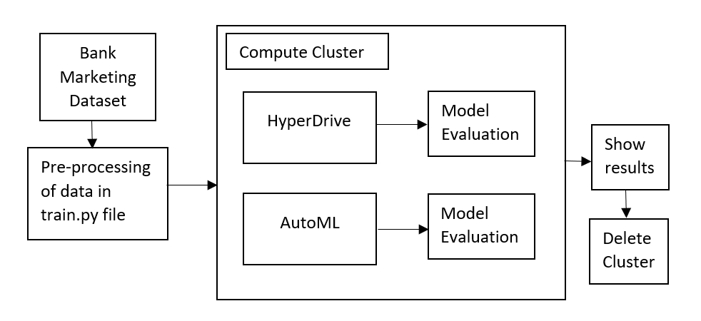
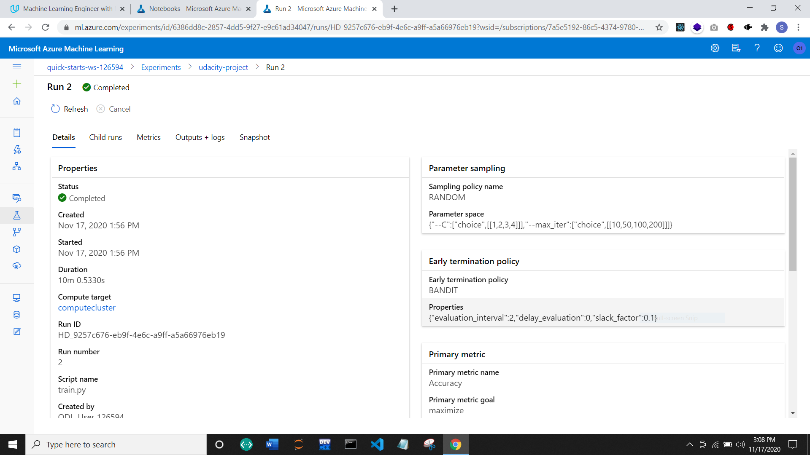
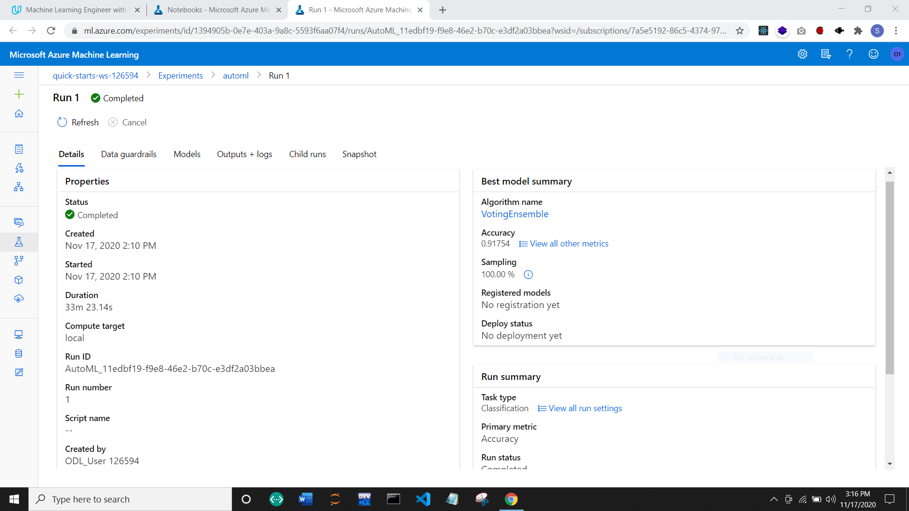
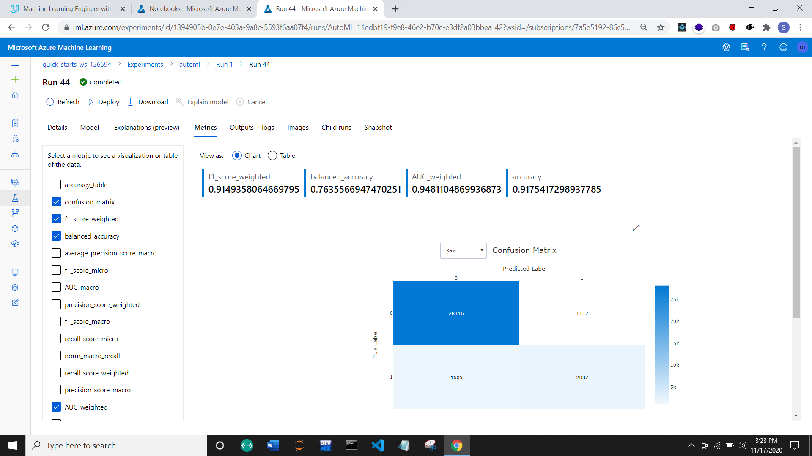

# Optimizing an ML Pipeline in Azure

## Overview
This project is part of the Udacity Azure ML Nanodegree.
In this project, we build and optimize an Azure ML pipeline using the Python SDK and a provided Scikit-learn model.
This model is then compared to an Azure AutoML run.

**Architecture diagram**

## Summary
The dataset used in this project contains information about Bank's Marketing Data. The aim is to predict if the customer subscribes to a fixed term deposit or not.
The best performing model was VotingEnsemble with the accuracy of 0.9175 using AutoML.

## Scikit-learn Pipeline
Firstly, the dataset was imported from specifies URL of Bank Marketing Data. It was then pre-processed in the clean_data function of train.py file and split into training and testing. After that Logistic Regression Model was used for training with tuning hyperparameters such as C and max_iter using HyperDrive.

Here, RandomParameterSampling was used as a parameter sampler because it covers most of the hyperparameter sample space from the continuous distribution along with less computation efforts.

Here, BanditPolicy was used as the early stopping policy which takes into account the slack factor and evaluation_interval. This helps to prevent the unnecessary computation and terminates the run with respect to best performing run.

## AutoML
Using the AutoML, VotingEnsemble model performed the best with the accuracy of 91.75%. The AutoMLConfig was used to set the parameters like experiment_timeout_minutes=30, task="classification", primary_metric="accuracy", label_column_name="y", n_cross_validations=5 and training_data as concatenation of x and y received from clean_data function.

The hyperparameters recommended by the AutoML for VotingEnsemble model are min_samples_leaf = 0.01, min_samples_split=0.01, min_weight_fraction_leaf=0.0, n_estimators=10 and n_jobs=1.

## Pipeline comparison
The accuracy using HyperDrive was 91.18% and with AutoML it gave better result with accuracy as 91.75% i.e 0.57% difference. This difference was because in HyperDrive we specified a fixed model (Logistic Regression) and could only improve the hyperparameters whereas AutoML gave us the flexibility to use various models and get the best result. Thus we can use HyperDrive when we know the model and have less computation power and AutoML when we need more complex computation. 

## Future work
Some areas of improvement for future experiments can be:
- Better pre-processing of data and to explore the important features which can result in better performance with quality data
- Using more combinations of hyperparameters with HyperDrive like C and max_iter and many more
- Exploring other parameters of AutoML
- Using other Azure ML SDK like XGBoost, LightGBM, H2O etc.
- Exploring different algorithms with different evaluation metrics to get better understanding of performance

## Output Screenshots

**Hyperdrive Run**

**AutoML Run**

**Best accuracy**

